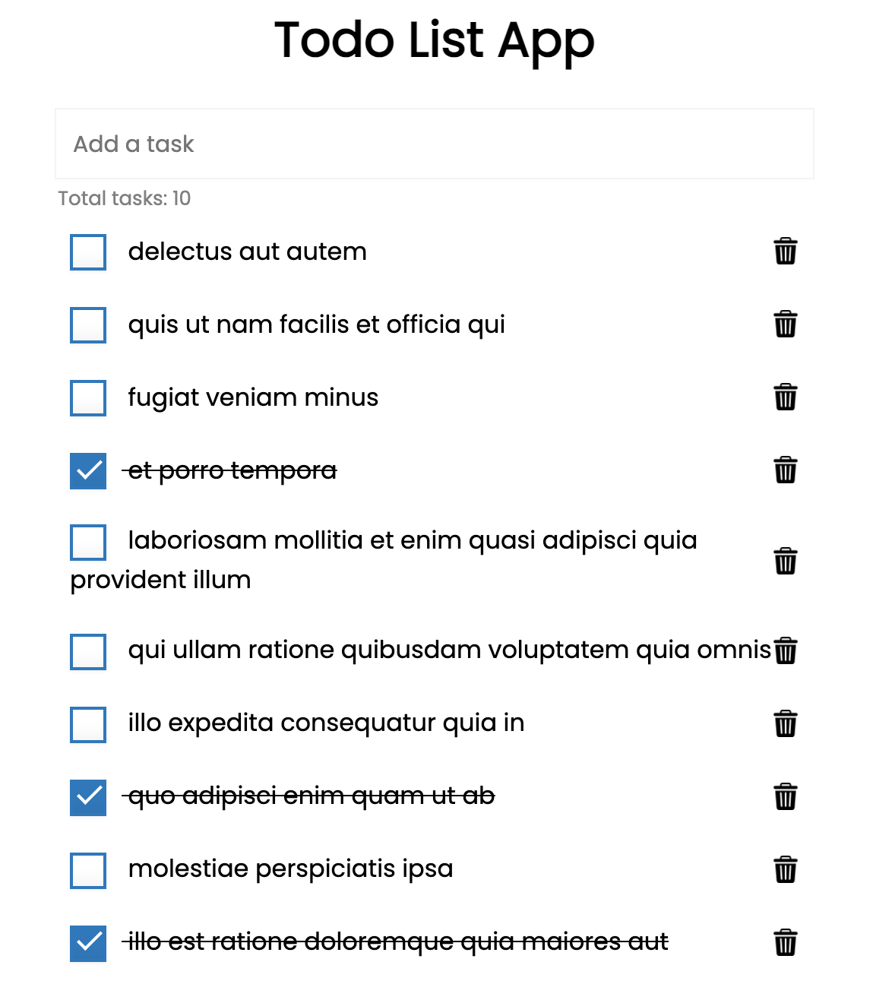

# Todo list app
- A todo list app 
- Contains some dummy todos fetched from JSONPlacefolder API 

### General information about the app 

- Functionality
	- Add a TODO
	- Delete a TODO
	- check task
	- total items count
- Data
	- tasksList - an array that stores all the task
	- task - individual task object with task id, content of the task as title and complete proporty{id, title, completed}
- Functions (in code)
	- initialiseApp
	- addTask
	- deleteTask
	- toggleTask
	- renderList
	- showNotification
	- handleClickListener
	- handleInputKeypress
	- addTaskToDOM
	- fetchTODOs 
